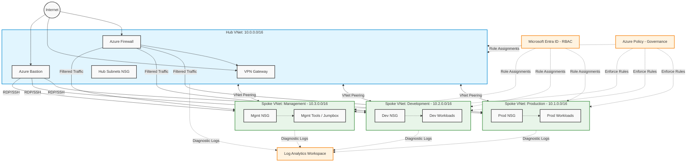

# Azure Landing Zone for SMBs 🚀

[](https://azure.microsoft.com/)
[](https://learn.microsoft.com/en-us/azure/azure-resource-manager/bicep/)
[](https://github.com/features/actions)
[](https://www.microsoft.com/security/business/identity-access/microsoft-entra-id)
[](https://azure.microsoft.com/en-us/services/monitor/)

Welcome to the **Azure Landing Zone for SMBs** project! This repository contains a production-ready Infrastructure-as-Code (IaC) deployment for Small-to-Medium Businesses (SMB) built with **Azure Bicep**. 

This portfolio project demonstrates applied Azure architecture, expanding on core AZ-900 fundamentals by integrating modern cloud principles, security, governance, and cost optimization.

---

## 🏛️ Architecture Diagram

Below is the hub-and-spoke network topology used in this Landing Zone. 

*(Note: If the Mermaid diagram doesn't render, view the [PNG fallback diagram here](./docs/architecture.png) - Exported via VS Code Mermaid Extension).*



---

## 🧠 Why This Architecture? (Connecting to AZ-900 Principles)

This design embodies core Azure cloud concepts suitable for a growing SMB:
1. **High Availability & Fault Tolerance:** By isolating workloads into multiple Spoke VNets (Prod, Dev, Mgmt), a failure or compromise in one environment doesn't automatically cascade to the others.
2. **Security & Least Privilege:** Employs zero-trust principles. All Spoke ingress/egress is routed through the Hub's Azure Firewall. Network Security Groups (NSGs) utilize explicit allow/deny rules, and Microsoft Entra ID applies strict RBAC limits.
3. **Governance & Compliance:** Azure Policy ensures that only approved regions are used and mandatory tags (Environment, Owner, CostCenter, Project) are appended to all resources, aligning with Microsoft Cloud Adoption Framework (CAF).
4. **Predictable Cost & Scalability:** Resource decoupling allows the Dev spoke to be scaled down or stopped during off-hours, while the Prod spoke remains highly available.
5. **Operational Excellence:** A centralized Log Analytics Workspace aggregates diagnostics logs across all layers, providing unified observability.

---

## 💰 Cost Estimate (Monthly Approximation for SMB Scale)

*Prices are estimated in USD and will vary based on Azure Region, actual usage, and licensing.*

| Component | Azure SKU / Configuration | Monthly Est. Cost |
| --- | --- | --- |
| **Azure Firewall** | Standard Tier (Base + Data Processing) | $900.00 |
| **VPN Gateway** | VpnGw1 (Base + Egress) | $140.00 |
| **Azure Bastion** | Basic Tier | $135.00 |
| **Log Analytics** | Pay-as-you-go (Est. 50GB ingest) | $150.00 |
| **Virtual Networks** | Hub + 3 Spokes (VNet Peering Traffic) | $50.00 |
| **Compute (Spokes)** | 3x B2ms VMs (Jumpbox, App, DB Placeholder) | $130.00 |
| **Governance / RBAC** | Azure Policy & Entra ID Free/P1 | $0.00 |
| **Total Estimated Monthly** | **Baseline Infrastructure** | **~ $1,505.00** |

*For more details on cost reduction strategies (like Reserved Instances), see [COST-OPTIMIZATION.md](./COST-OPTIMIZATION.md).*

---

## 🚀 Getting Started

### Prerequisites

Ensure you have the following installed on your local machine:
- [Azure CLI](https://learn.microsoft.com/en-us/cli/azure/install-azure-cli)
- [Bicep CLI](https://learn.microsoft.com/en-us/azure/azure-resource-manager/bicep/install)
- An active Azure Subscription

### Deployment Steps

1. **Clone the repository:**
   ```bash
   git clone https://github.com/yourusername/azure-landing-zone-smb.git
   cd azure-landing-zone-smb
   ```

2. **Login to Azure:**
   ```bash
   az login
   az account set --subscription "<YOUR_SUBSCRIPTION_ID>"
   ```

3. **Deploy the Landing Zone (Dev Environment):**
   ```bash
   # Create a resource group for the deployment
   az group create --name rg-smb-landingzone-dev-eus --location eastus

   # Deploy the main Bicep template using the Dev parameter file
   az deployment group create \
     --resource-group rg-smb-landingzone-dev-eus \
     --template-file main.bicep \
     --parameters @parameters/dev.parameters.json
   ```

For a detailed deployment breakdown, review the [IMPLEMENTATION-GUIDE.md](./IMPLEMENTATION-GUIDE.md).

---

## 📂 Documentation

- [ARCHITECTURE.md](./ARCHITECTURE.md) - Deep dive into Hub-and-Spoke design and traffic flows.
- [RBAC-DESIGN.md](./RBAC-DESIGN.md) - Role matrix and least-privilege Entra ID configurations.
- [COST-OPTIMIZATION.md](./COST-OPTIMIZATION.md) - Right-sizing, reserved instances, and tagging strategies.
- [GOVERNANCE.md](./GOVERNANCE.md) - Azure Policy, naming conventions, and compliance.
- [IMPLEMENTATION-GUIDE.md](./IMPLEMENTATION-GUIDE.md) - Step-by-step deployment and validation.
- [CHANGELOG.md](./CHANGELOG.md) - Roadmap and future additions.